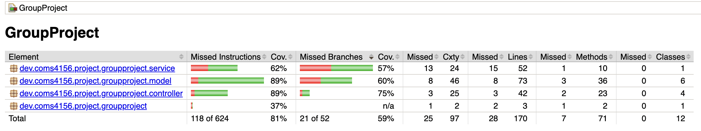

# COMSW4156_Runtime_Terrors_Project

This is the GitHub repository for the Team Project associated with COMS 4156 Advanced Software Engineering. Our team name is **Runtime Terrors** and the following are our members: Lizette Hernandez, Meron Belachew, Alessandro Castillo, Katherine Newton, and Joseph Jojoe.

# Viewing the Project Repository
___
Please use the following link to view the repository relevant to the app: [https://github.com/josephjojoe/COMSW4156_Team_Project](https://github.com/josephjojoe/COMSW4156_Team_Project)

# Where to find example client build

Got to:
**client/**

# Building and Running a Local Instance
___
To build and use this service you must install the following (This guide assumes MacOS):
1. Maven 3.9.11: : https://maven.apache.org/download.cgi Download and follow the installation instructions
2. JDK 17: Project is configured for Java 17 in `server/pom.xml`. Install JDK 17 from: https://adoptium.net/temurin/releases/?version=17
3. IntelliJ IDE: We recommend using IntelliJ but you are free to use any other IDE that you are comfortable with: https://www.jetbrains.com/idea/download/?section=windows
4. If you wish to run the style checker you can with mvn checkstyle:check or mvn checkstyle:checkstyle if you wish to generate the report.

The endpoints are listed below in the "Endpoints" section, with brief descriptions of their parameters. For in-depth examples and system-level tests of them, see the section "Postman Test Documentation" below.

# Running the Service
___

From the repository root, run the Spring Boot app:

```
cd server
mvn spring-boot:run
```

The service starts on port 8080 by default.

To build a runnable JAR:

```
cd server
mvn clean package
java -jar target/groupproject-0.0.1-SNAPSHOT.jar
```
# Running Tests
___

```
cd server
mvn test
```

This runs all unit and integration tests.

Code coverage (JaCoCo) report is generated at:

```
server/target/site/jacoco/index.html
```

Course requirement: minimum 55% coverage. We track this via the JaCoCo report (threshold not yet enforced in the build).
# Endpoints
___

Base URL: `http://localhost:8080`

- POST `/queue` — Create a queue
  - Request body:
    - `name` (string, required)
  - Example:
    ```json
    { "name": "MyQueue" }
    ```
  - Responses:
    - 201 Created: Queue object `{ id, name, taskCount, resultCount }`
    - 400 Bad Request: error message

  - curl example:
    ```bash
    curl -s -X POST http://localhost:8080/queue \
      -H 'Content-Type: application/json' \
      -d '{"name":"MyQueue"}'
    ```

- POST `/queue/{id}/task` — Enqueue a task
  - Path params:
    - `id` (UUID, queue ID)
  - Request body:
    - `params` (string, required)
    - `priority` (int, required; lower value = higher priority)
  - Example:
    ```json
    { "params": "{\\"job\\":\\"example\\"}", "priority": 1 }
    ```
  - Responses:
    - 201 Created: Task object `{ id, params, priority, status }`
    - 400 Bad Request: error message
    - 404 Not Found: queue not found

  - curl example:
    ```bash
    curl -s -X POST http://localhost:8080/queue/<QUEUE_ID>/task \
      -H 'Content-Type: application/json' \
      -d '{"params":"{\\"job\\":\\"example\\"}","priority":1}'
    ```

- GET `/queue/{id}/task` — Dequeue highest priority task
  - Path params:
    - `id` (UUID, queue ID)
  - Responses:
    - 200 OK: Task object `{ id, params, priority, status }` (status will be `IN_PROGRESS`)
    - 204 No Content: queue empty
    - 404 Not Found: queue not found

  - curl example:
    ```bash
    curl -s http://localhost:8080/queue/<QUEUE_ID>/task
    ```

- POST `/queue/{id}/result` — Submit a task result
  - Path params:
    - `id` (UUID, queue ID)
  - Request body:
    - `taskId` (UUID, required)
    - `output` (string, required)
    - `status` (enum, required: `SUCCESS` | `FAILURE`)
  - Example:
    ```json
    { "taskId": "<TASK_UUID>", "output": "ok", "status": "SUCCESS" }
    ```
  - Responses:
    - 201 Created: Result object `{ taskId, output, status, timestamp }`
    - 400 Bad Request: error message
    - 404 Not Found: queue not found

  - curl example:
    ```bash
    curl -s -X POST http://localhost:8080/queue/<QUEUE_ID>/result \
      -H 'Content-Type: application/json' \
      -d '{"taskId":"<TASK_ID>","output":"ok","status":"SUCCESS"}'
    ```

- GET `/queue/{id}/result/{taskId}` — Get a task result
  - Path params:
    - `id` (UUID, queue ID)
    - `taskId` (UUID, task ID)
  - Responses:
    - 200 OK: Result object `{ taskId, output, status, timestamp }`
    - 404 Not Found: result not found or queue not found

  - curl example:
    ```bash
    curl -s http://localhost:8080/queue/<QUEUE_ID>/result/<TASK_ID>
    ```

- GET `/queue/{id}/status` — Get queue status (for aggregators)
  - Path params:
    - `id` (UUID, queue ID)
  - Responses:
    - 200 OK: Status object `{ id, name, pendingTaskCount, completedResultCount, hasPendingTasks }`
    - 404 Not Found: queue not found
  - Use case: Aggregators poll this endpoint to check if all tasks have been processed

  - curl example:
    ```bash
    curl -s http://localhost:8080/queue/<QUEUE_ID>/status
    ```

- DELETE `/queue/admin/clear` — Clear all queues (admin)
  - **WARNING**: This operation is destructive and cannot be undone. All queues, tasks, and results will be permanently deleted.
  - Responses:
    - 200 OK: `{ message, queuesCleared }`
  - Use case: Testing and cleanup

  - curl example:
    ```bash
    curl -s -X DELETE http://localhost:8080/queue/admin/clear
    ```

# Quick curl walkthrough
___

Below is a copy-pasteable sequence to exercise the full flow using `bash` and `jq`.

```
# Base URL
BASE=http://localhost:8080

# 1) Create a queue
QUEUE_ID=$(curl -s -X POST "$BASE/queue" \
  -H 'Content-Type: application/json' \
  -d '{"name":"MyQueue"}' | jq -r .id)
echo "QUEUE_ID=$QUEUE_ID"

# 2) Enqueue a task (priority: 1)
TASK_ID=$(curl -s -X POST "$BASE/queue/$QUEUE_ID/task" \
  -H 'Content-Type: application/json' \
  -d '{"params":"{\\"job\\":\\"example\\"}","priority":1}' | jq -r .id)
echo "TASK_ID=$TASK_ID"

# 3) Dequeue a task (worker retrieves next task)
curl -s "$BASE/queue/$QUEUE_ID/task" | jq .

# 4) Submit the result for the task
curl -s -X POST "$BASE/queue/$QUEUE_ID/result" \
  -H 'Content-Type: application/json' \
  -d '{"taskId":"'"$TASK_ID"'","output":"ok","status":"SUCCESS"}' | jq .

# 5) Retrieve the result by taskId
curl -s "$BASE/queue/$QUEUE_ID/result/$TASK_ID" | jq .
```

do brew install jq if you do not have jq
# Testing our Service
___

Unit Tests:
- We document the set of equivalence partitions we defined for each unit, and which tests target which partition(s) in the header comments of our testing files.

Api Tests:
- We document the set of equivalence partitions we have defined for each end point, and which tests target which partition(s) in the header comments of our testing files.

Integration tests:
- Internal: We document each test to explain what it is integrating with in the header comments of our integration testing files.

- External: Our service does not interact with external systems such as databases, files, or third-party APIs.


# Continuous Integration
___
Our project uses a GitHub Actions CI workflow located at .github/workflows/main.yml. The CI loop runs automatically on every push and pull request to the main branch. It performs all required quality checks specified in the course rubric.

1. Static analysis  
   The CI workflow runs PMD on the entire service codebase using the maven pmd plugin. PMD initially detected multiple issues including missing log guards, unnecessary constructors, unused imports, and design rule violations. We fixed all reported issues. Before and after PMD output files are included in reports/static-analysis/before and reports/static-analysis/after.

2. Style checking  
   The CI workflow runs Checkstyle using the maven checkstyle plugin, enforcing Google Java Style across the entire service including tests. All Checkstyle violations detected during development were fixed and CI now passes with no style errors.

3. Unit testing  
   The CI workflow runs all unit tests with mvn test. Unit tests cover valid and invalid equivalence partitions and boundary cases for each major unit.

4. API testing  
   The CI workflow runs our API tests which exercise all service endpoints with both valid and invalid inputs.

5. Integration testing  
   The CI workflow runs integration tests which cover interactions between multiple classes and the shared data among them.

6. Coverage  
   The CI workflow runs the Jacoco plugin during mvn verify to generate branch coverage reports. The most recent coverage report is included in the metrics directory.

Together these automated steps ensure that every pull request is checked for correct functionality, style consistency, thorough test coverage, and static analysis cleanliness before merging into the main branch.

# Code Style (Checkstyle)
___

We use Checkstyle for code style compliance (Google style). The Maven plugin is configured in `server/pom.xml`.

- Run style checks:
  ```
  cd server
  mvn checkstyle:check
  ```
- Generate a style report:
  ```
  cd server
  mvn checkstyle:checkstyle
  open target/site/checkstyle.html
  ```

Note: The plugin references `google_checks.xml`. Ensure this file is present in `server/` or update the plugin configuration accordingly. If missing, the check will fail.

# Static Analysis
___
We use PMD as our static analysis bug finder.
- Run static analysis bug finder
  pmd check -d src -R rulesets/java/quickstart.xml -f xml

Some before/after reports from our static analyzer can be located in reports/static-analysis/before/ and reports/static-analysis/after/

# Links
___

- Class Diagram: https://lucid.app/lucidchart/8a4ba69a-6f81-4bf6-a6c1-08ea5ab49e14/edit?beaconFlowId=781D649DE0B7F69C&invitationId=inv_2c0e7564-fc77-4029-bdf8-8b5c33887816&page=0_0#

- Project Management(Linear): https://linear.app/runtime-terrors/team/RUN/active 

# Style Checking Report
Our codebase passes all Checkstyle checks with **zero violations or warnings**.

There's a copy our most recent Checkstyle + PMD result files in the /metrics directory.

# Branch Coverage Report
## **Current Coverage Status (Iteration 1)**


| Metric | Coverage |
|--------|----------|
| **Instructions** | 81% |
| **Branches** | 59% |
| **Lines** | 83% |
| **Methods** | 90% |
| **Classes** | 100% |

# Static Code Analysis
___
# Tools used
___

This section includes notes on tools and technologies used in building this project.

- Maven Package Manager
- GitHub Actions CI (planned)
    - CI workflow YAML to be added under `.github/workflows/`
- Checkstyle
    - We use Checkstyle for code reporting.
- PMD (planned)
    - PMD ruleset and plugin configuration to be added.
- JUnit
    - JUnit tests get run automatically as part of the CI pipeline.
- JaCoCo
    - We use JaCoCo for generating code coverage reports.
- Postman (planned)
    - We will use Postman for testing that the APIs work.
- Mockito (planned)
    - We use Mockito to create mock objects and isolate unit tests from external dependencies.

# Cloning the Repository and Running it on Your Machine
___

0. Cloning the Repository and Running it on Your Machine

Follow these steps to create a private replicate of the student repoLinks to an external site.:

Create a new directory for your project

Inside the new repo, run:

```
git clone https://github.com/Programming-Systems-Lab/4156-Miniproject-2025-Students.git
```

Enter the new directory:

```
cd 4156-Miniproject-2025-Students
```

Remove the old remote origin:

```
git remote remove origin
```

Create a new, private repo on GitHubLinks to an external site.

In the directory 4156-Miniproject-2025-Students, add the new remote origin:

```
git remote add origin <your new, private GitHub repo url>
```

Push all the contents:

```
git push -u origin --all
```

To run the service:

```
mvn compile
mvn spring-boot:run
```

Running this command for the first time should install the necessary dependencies, but you may notice there are some small bugs preventing the command from working. You will need to fix these before continuing. Make sure to document these bugs as described in part 3 of this assignment. After the fix, it will have started the server where you can make requests at 127.0.0.1:8080 or localhost:8080.

# Code Clean Up
___

Reading code is a great way to understand what it does and is an important skill to have. The previous developers of this codebase left it a terrible mess. Your first job is to make the codebase clean again. By clean, we mean that:

- The `mvn checkstyle:check` command in the terminal yields no warnings or violations.
- The `mvn checkstyle:checkstyle` command generates an empty report.
- The code still runs and works as expected.

The style guide used is the Google Java Style GuideLinks to an external site.. If you need a refresher on Javadocs, see this resourceLinks to an external site..

Note: checkstyle is NOT a bug finder -- this distinction will be discussed in lecture. You are not allowed to use plugins like OpenRewrite or any auto-formatters to automate this process. The restriction is to give you experience with manual cleanup. No such restriction applies to the group project.

# Test Suite Creation
___

In the repo, there is a test folder with a partially completed test suite. You must expand it to cover most methods in the codebase. Avoid testing only the happy path; include edge cases.

You are required to have a minimum of at least 55% branch coverage reported by JaCoCo for the tests you write. Do not try to reach 100% or close to 100% for this assignment because for assignments 2 and 3, your coverage must strictly increase (e.g., you can reach 60% for this assignment, 80% for assignment 2, 90% for assignment 3). You can generate JaCoCo coverage report in the target/site/jacoco directory by using 

```
mvn clean test
mvn jacoco:report
```

You will also need to make a separate test class file for each class you test (e.g., BookTest, IndividualProjectApplicationTest). Do not put all tests in one file. Tests can be unit tests or another type as long as requirements are met.

Note: For group projects you’ll have a strict 85% branch coverage requirement.
